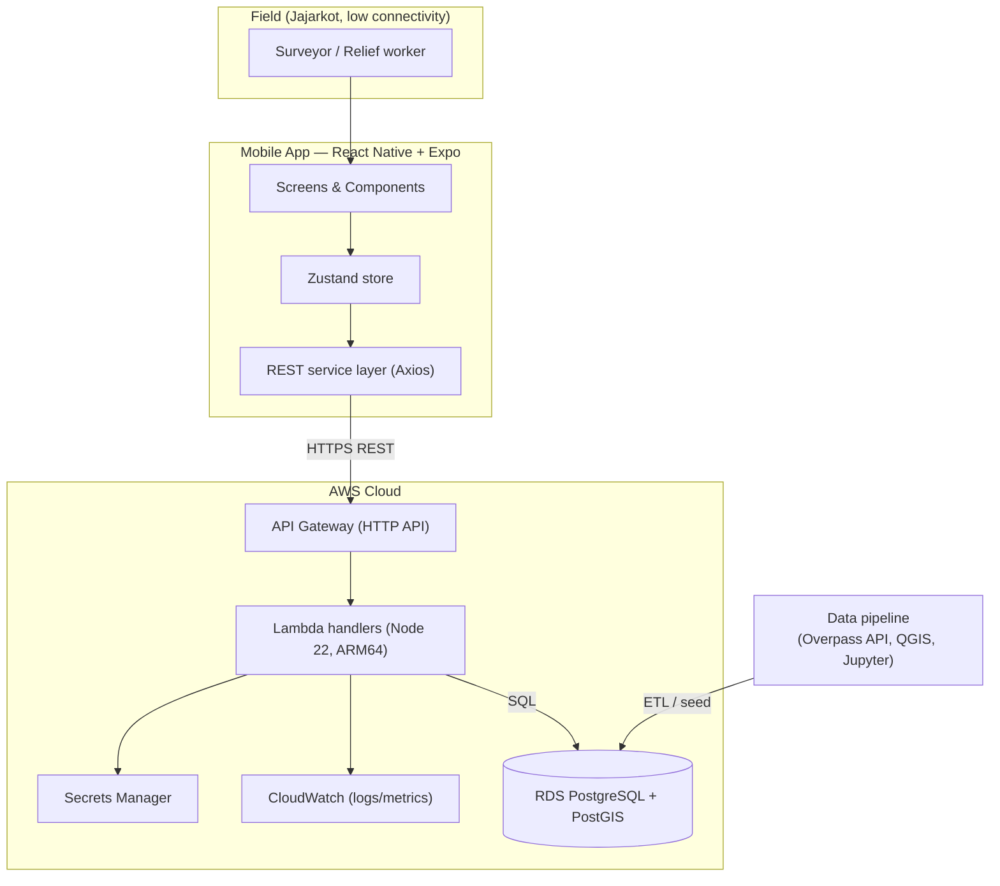
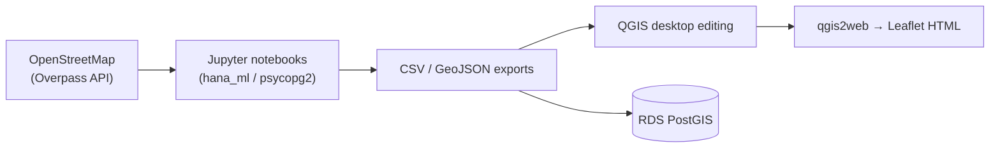
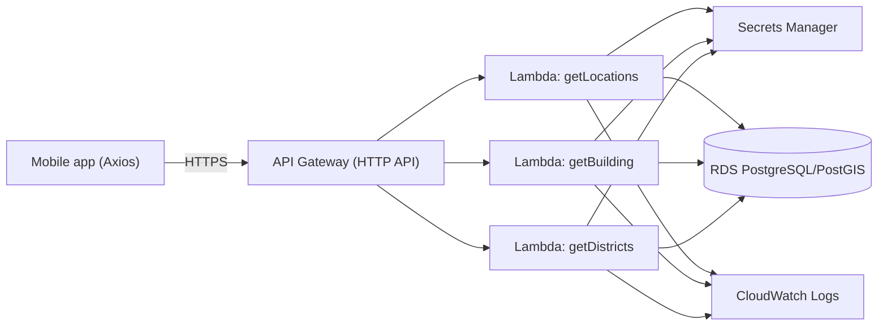
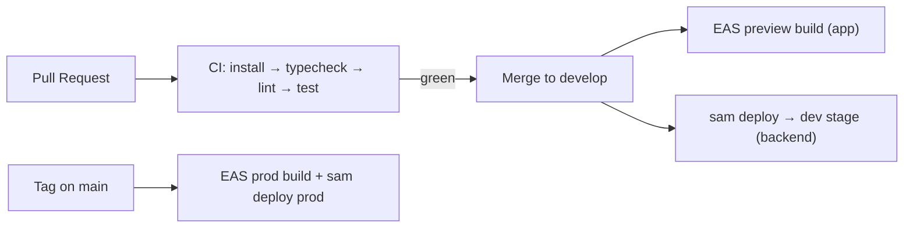
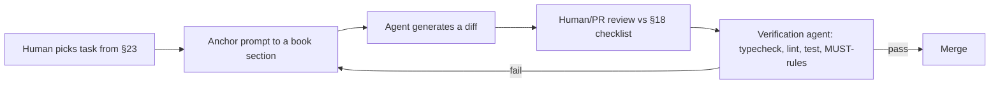

# Nepal Aid — Developer Book

### LivaApp · Geospatial Damage Assessment & Aid Management
### Migration from SAP AppGyver → React Native (Expo) + AWS Serverless + PostgreSQL/PostGIS

---

| | |
|---|---|
| **Document** | Developer Book (living document) |
| **Project** | Nepal Aid / LivaApp |
| **Partner** | buildchange.org |
| **Context** | 2023 Jajarkot (Nepal) earthquake — field damage assessment |
| **Status** | Working document — `v0.1` |
| **Primary IDE** | IntelliJ IDEA Ultimate |
| **Build target** | Runnable codebase, ready to propose *as-is* to buildchange.org |
| **AI collaborator** | Claude CoWork (Claude Agent) |
| **Owner** | Ing. Marcello Vinci |
| **Last updated** | 2026-06-30 |

> **How to use this book.** This is the single source of truth for anyone — human developer or AI agent — building the Nepal Aid mobile application. It is intended to be read top-to-bottom once, then used as a reference. It is a *working document*: when a decision changes, update the relevant section and the changelog at the end. Every architectural choice is captured as an Architecture Decision Record (ADR) so the reasoning survives even when the author does not.

> **Relationship to `DEV_HANDOVER.md`.** The original `DEV_HANDOVER.md` (~10 pages) is the bootstrap brief. This Developer Book supersedes and expands it. Where the two disagree, this book wins. `DEV_HANDOVER.md` is kept for historical reference.

---

## Table of Contents

1. [Executive Summary](#1-executive-summary)
2. [Glossary & Conventions](#2-glossary--conventions)
3. [System Architecture](#3-system-architecture)
4. [Architecture Decision Records (ADRs)](#4-architecture-decision-records-adrs)
5. [Developer Onboarding](#5-developer-onboarding)
6. [IntelliJ IDEA + Claude CoWork Guide](#6-intellij-idea--claude-cowork-guide)
7. [Expo / React Native Setup](#7-expo--react-native-setup)
8. [Project Structure & Configuration](#8-project-structure--configuration)
9. [Frontend: Navigation & Screens](#9-frontend-navigation--screens)
10. [Component Library](#10-component-library)
11. [State Management (Zustand)](#11-state-management-zustand)
12. [Service & REST Layer](#12-service--rest-layer)
13. [UI Guidelines & Design System](#13-ui-guidelines--design-system)
14. [AWS Serverless Backend](#14-aws-serverless-backend)
15. [PostgreSQL / PostGIS & GIS Conventions](#15-postgresql--postgis--gis-conventions)
16. [API Specification (OpenAPI)](#16-api-specification-openapi)
17. [Coding Standards](#17-coding-standards)
18. [Git Workflow](#18-git-workflow)
19. [CI/CD](#19-cicd)
20. [Testing Strategy](#20-testing-strategy)
21. [Prompt Engineering for AI Agents](#21-prompt-engineering-for-ai-agents)
22. [Troubleshooting Playbook](#22-troubleshooting-playbook)
23. [Evolutionary Roadmap](#23-evolutionary-roadmap)
24. [Appendices](#24-appendices)
25. [Changelog](#25-changelog)

---

# 1. Executive Summary

## 1.1 What this project is

Nepal Aid (internal app name **LivaApp**) is a field tool that lets relief teams browse, locate, and assess earthquake-damaged buildings and wards in the Jajarkot region of Nepal. A surveyor opens the app, selects a **damage group** (a band of structural damage severity), gets a list of affected locations with district / ward / coordinates, drills into a location, and opens a map for on-site navigation.

The original application was built in **SAP AppGyver** (now retired by SAP) on top of a geospatial dataset. The goal of this project is to **rebuild the app on a modern, open, vendor-neutral stack** that buildchange.org can adopt, host, and evolve without dependence on a deprecated low-code platform.

## 1.2 Why we are migrating

| Driver | Detail |
|---|---|
| **Platform end-of-life** | SAP AppGyver has been retired; no long-term support. |
| **Ownership & portability** | buildchange.org needs to own and self-host the stack. |
| **Cost** | Serverless (pay-per-request) suits an NGO with bursty, campaign-based usage. |
| **Offline future** | Field work in Jajarkot has poor connectivity; the architecture must allow offline sync later. |
| **Talent availability** | React Native + AWS + PostgreSQL is mainstream and hireable; AppGyver is not. |

## 1.3 Target architecture, in one line

```
React Native (Expo) → Axios → API Gateway → AWS Lambda → RDS PostgreSQL/PostGIS
```

The mobile client **never** talks to the database directly. All data access goes through a thin REST API. This is the single most important architectural rule in this book.

## 1.4 The deliverable to buildchange.org

The concrete output of this effort is a **runnable codebase developed in IntelliJ IDEA** that can be proposed *as-is* to buildchange.org:

- a React Native (Expo) mobile app that builds and runs on iOS and Android;
- a set of AWS Lambda handlers exposing the REST API;
- the PostGIS schema and seed/migration scripts;
- an OpenAPI contract that documents the API;
- this Developer Book so any new engineer or AI agent can continue the work.

"As-is" means: it compiles, it runs against a real (or mocked) backend, and the repository tells a coherent story. It does not need to be feature-complete to be proposable — but it must be **credible and runnable**.

## 1.5 Reading paths

- **New human developer:** read §1–§12 in order, then start coding from §7.
- **AI agent (Claude CoWork):** read §2, §3, §4, §17, §21 before writing any code.
- **buildchange.org reviewer / stakeholder:** read §1, §3, §14, §23.
- **DevOps / infra:** read §3, §14, §15, §19.

---

# 2. Glossary & Conventions

## 2.1 Domain glossary

| Term | Meaning |
|---|---|
| **Ward** | Smallest administrative unit in Nepal. The dataset covers ~45 wards across the Jajarkot area. |
| **District / Municipality** | Administrative parent of a ward (e.g. *Bheri*, *Sindhupalchok*). The source data mixes "district" and "municipality" naming; treat the human-readable label as `district` in the API. |
| **Damage group** | A categorical band of structural damage severity used to triage buildings/wards. Surveyors filter by damage group. Derived from the `DAMAGE_PCT_*` columns. |
| **Damage percentage (`DAMAGE_PCT_0M/10M/20M`)** | Estimated proportion of damaged structures within 0 m / 10 m / 20 m buffers of a feature. Values are 0–1 floats. |
| **AOI (Area of Interest)** | The Jajarkot bounding box: `28.4636°N 81.9261°E` → `28.8131°N 82.5596°E`. All geospatial queries are scoped to this box unless stated otherwise. |
| **Feature** | A geospatial record (ward polygon, building point/footprint, POI, or street segment). |
| **Inspection** | A field observation captured by a surveyor against a building. Future write-path (`POST /inspection`). |
| **Liva** | The mobile app brand / the field data-collection app. "LivaApp" = this project. |

## 2.2 Technical glossary

| Term | Meaning |
|---|---|
| **PostGIS** | Spatial extension for PostgreSQL. Provides `GEOMETRY` types and spatial functions (`ST_X`, `ST_Y`, `ST_Contains`, …). |
| **SRID 4326** | WGS84 lat/lon coordinate system. The app's canonical CRS. All geometry exposed to the client is 4326. |
| **Lambda** | AWS function-as-a-service. One handler per logical endpoint (or a small router). |
| **API Gateway** | AWS managed HTTP front door that routes requests to Lambdas. |
| **Secrets Manager** | AWS service holding DB credentials. The app never hardcodes secrets. |
| **Expo** | Managed React Native toolchain (build, OTA, native modules without Xcode/Android Studio for most work). |
| **Zustand** | Minimal React state-management library. Our single global store. |
| **ADR** | Architecture Decision Record — a short doc capturing one decision, its context, and consequences. |

## 2.3 Naming & writing conventions used in this book

- `inline code` = literal commands, filenames, identifiers.
- Blockquotes (`>`) = rules, warnings, or rationale.
- **MUST / MUST NOT / SHOULD** are used in the RFC-2119 sense. A **MUST** is non-negotiable; breaking it is a bug.
- Code blocks are copy-paste ready unless marked `// pseudocode`.

## 2.4 The five non-negotiable rules (MUST)

> 1. **The mobile app MUST NOT connect to PostgreSQL directly.** Only via REST.
> 2. **Secrets MUST NOT be hardcoded.** DB credentials come from Secrets Manager / env, never the repo.
> 3. **All client-facing geometry MUST be SRID 4326** (lat/lon), serialized as plain numbers, not WKB.
> 4. **The existing UX MUST be preserved.** Rebuild the app; do not redesign the flows.
> 5. **Every architectural decision MUST be recorded as an ADR** (§4) before it is implemented.

---

# 3. System Architecture

## 3.1 Context diagram



## 3.2 Layered view

| Layer | Technology | Responsibility | MUST NOT |
|---|---|---|---|
| **Presentation** | React Native screens/components | Render UI, capture input | Contain SQL or AWS SDK calls |
| **State** | Zustand store | Hold selected damage group, building, cache, GPS, loading | Fetch data directly |
| **Service** | Axios client + typed functions | Talk to REST API, map responses to models | Know about UI |
| **API** | API Gateway | Route, throttle, CORS, auth | Hold business logic |
| **Compute** | Lambda (Node 22, ARM64) | Validate input, run SQL, shape JSON | Hold UI concerns or hardcode secrets |
| **Secrets** | Secrets Manager | Supply DB credentials at runtime | Be bypassed by hardcoded values |
| **Data** | RDS PostgreSQL/PostGIS | Store features, run spatial queries | Be reachable from the client |
| **Observability** | CloudWatch | Logs, metrics, alarms | — |

## 3.3 Request lifecycle (read path)

```
1. User selects Damage Group 3 on HomeScreen.
2. Store sets selectedDamageGroup = 3; ListScreen mounts.
3. Service calls GET /locations?damageGroup=3 via Axios.
4. API Gateway routes to the `getLocations` Lambda.
5. Lambda reads DB creds from Secrets Manager (cached across warm invocations).
6. Lambda runs a parameterized PostGIS query, scoped to the AOI.
7. Lambda returns JSON: [{ id, district, ward, lat, lon, damageGroup }, ...].
8. Service maps JSON → Building[] models; store caches them.
9. ListScreen renders BuildingCard list; user drills into DetailScreen → MapScreen.
```

## 3.4 Data pipeline (offline / build-time)

The geospatial data that seeds RDS is produced by an existing pipeline (kept in the repo):



> The pipeline is **build-time / analytical**, not part of the live request path. It is documented in §15.4 and in the repo notebooks (`2023 Q1 road net work via overpass.ipynb`, `Liva new.ipynb`).

## 3.5 Environments

| Environment | Purpose | Backend |
|---|---|---|
| **local** | Day-to-day dev in IntelliJ | Mock REST (MSW) or `dev` API Gateway stage |
| **dev** | Shared integration | API Gateway `dev` stage → dev RDS |
| **prod** | Demo / handover to buildchange.org | API Gateway `prod` stage → prod RDS |

> For the buildchange.org proposal, a working **local + dev** is sufficient. Prod can be a single hardened stage.

## 3.6 Reconciling the data model

The bootstrap brief referenced a `buildings` table with a `damage_group` column. The **actual** repo schema (`Build App and backend/schema.sql`) defines `WARDS`, `POIS`, `STREET_NETWORK_WAYS`, and `JAJARKOT_VISITED`, and the primary dataset (`Nepal_Aid_New45.csv`) is keyed by `WARD` / `DISTRICT` with `DAMAGE_PCT_0M/10M/20M`.

> **Decision (see ADR-009):** The API speaks a *stable contract* (`/locations`, fields `id, district, ward, lat, lon, damageGroup`). The Lambda layer is responsible for mapping whatever the physical schema is (wards, derived damage groups) onto that contract. This decouples the app from schema churn. `damageGroup` is **derived** from `DAMAGE_PCT_*` bands (see §15.3).

---

# 4. Architecture Decision Records (ADRs)

> An ADR captures **one** decision. Format: Context → Decision → Status → Consequences → Alternatives. New decisions get a new ADR; superseded ones are marked, not deleted. Number them sequentially.

### ADR-001 — Use React Native for the mobile client

- **Status:** Accepted.
- **Context:** AppGyver is retired. We need a cross-platform, hireable, long-lived mobile stack.
- **Decision:** Build the app in **React Native**.
- **Consequences:** One codebase for iOS + Android; large ecosystem; JS/TS skills reusable across the org. Requires JS tooling discipline.
- **Alternatives:** *Flutter* (rejected — Dart is less reusable with our web/AWS JS stack); *Ionic* (rejected — webview performance for maps); *native iOS+Android* (rejected — double the work for an NGO budget).

### ADR-002 — Use Expo (managed workflow) initially

- **Status:** Accepted.
- **Context:** We want fast iteration without managing Xcode/Gradle from day one.
- **Decision:** Start on **Expo managed workflow**; keep the option to *prebuild / eject* if a native module demands it.
- **Consequences:** OTA updates, easy device testing via Expo Go, simpler CI. Some native libraries need `expo prebuild` / config plugins.
- **Alternatives:** Bare React Native (rejected initially — more setup friction; revisit only if blocked).

### ADR-003 — Serverless backend (API Gateway + Lambda), no servers

- **Status:** Accepted.
- **Context:** NGO usage is bursty and campaign-driven; we want pay-per-use and minimal ops.
- **Decision:** **API Gateway → Lambda**. No Express, no EC2, no Docker required for the API.
- **Consequences:** Scales to zero; cheap at low volume; per-function IAM. Cold starts (mitigated by ARM64 + small bundles + connection reuse). VPC access to RDS needs care (§14.5).
- **Alternatives:** Express on EC2/ECS (rejected — always-on cost, patching); Fargate (rejected — heavier than needed now).

### ADR-004 — PostgreSQL + PostGIS on RDS as the system of record

- **Status:** Accepted.
- **Context:** The domain is geospatial; the original analytics used SAP HANA spatial. We need open, portable spatial SQL.
- **Decision:** **RDS PostgreSQL with PostGIS**.
- **Consequences:** Rich spatial functions, open-source, portable, QGIS-compatible. Must manage VPC/connectivity for Lambda.
- **Alternatives:** SAP HANA Cloud (rejected — vendor lock-in, cost for an NGO); DynamoDB (rejected — no spatial joins); Aurora Serverless v2 (acceptable future upgrade — see Roadmap).

### ADR-005 — REST only; the client never touches the DB

- **Status:** Accepted (this is a **MUST**).
- **Context:** Security, portability, and the ability to evolve the schema independently.
- **Decision:** All data access via **REST** behind API Gateway. The mobile app holds no DB driver, no connection string.
- **Consequences:** Clean separation; schema can change behind a stable contract; credentials stay server-side.
- **Alternatives:** GraphQL (rejected for v1 — overkill; revisit if the client needs flexible querying); direct DB (rejected — insecure, non-negotiable).

### ADR-006 — Zustand for state, not Redux

- **Status:** Accepted.
- **Context:** App state is small (selected group, selected building, cache, GPS, loading).
- **Decision:** **Zustand**.
- **Consequences:** Minimal boilerplate, fast, hooks-based. Less ecosystem tooling than Redux (acceptable at this size).
- **Alternatives:** Redux Toolkit (rejected — boilerplate disproportionate to need); Context only (rejected — re-render concerns for cached lists).

### ADR-007 — IntelliJ IDEA Ultimate as the primary IDE

- **Status:** Accepted.
- **Context:** Existing JetBrains ecosystem; integrated AWS Toolkit, DB browser, Git, and Claude CoWork.
- **Decision:** **IntelliJ IDEA Ultimate** is the canonical IDE; the repo ships JetBrains run configs and code style.
- **Consequences:** Consistent dev experience; built-in DB tooling for PostGIS; AWS Toolkit for Lambda. VS Code remains usable but unsupported in docs.
- **Alternatives:** VS Code (evaluated, not selected as canonical).

### ADR-008 — TypeScript across app and Lambdas

- **Status:** Accepted.
- **Context:** The bootstrap brief showed `.js`, but a multi-month, multi-agent project needs type safety.
- **Decision:** Use **TypeScript** for both the React Native app and the Lambda handlers. Shared model types live in a `models/` module and are mirrored server-side.
- **Consequences:** Compile-time safety, better AI-agent assistance, self-documenting contracts. Slightly more setup.
- **Alternatives:** Plain JS (rejected — too error-prone for a long-lived, AI-assisted codebase). *This ADR supersedes the JS assumption in `DEV_HANDOVER.md`.*

### ADR-009 — Stable API contract decoupled from physical schema

- **Status:** Accepted.
- **Context:** The physical schema (`WARDS`, damage percentages) differs from the conceptual API (`/locations`, `damageGroup`).
- **Decision:** The API exposes a **stable contract**; Lambdas map physical schema → contract. `damageGroup` is **derived** from `DAMAGE_PCT_*` bands.
- **Consequences:** Schema can evolve without breaking the app; mapping logic is centralized and testable. Requires a documented derivation rule (§15.3).
- **Alternatives:** Expose raw tables (rejected — couples client to schema churn).

### ADR-010 — Offline-ready, but online-first for v1

- **Status:** Accepted.
- **Context:** Jajarkot connectivity is poor; full offline sync is complex.
- **Decision:** v1 is **online-first** but **structured for offline**: all I/O behind the service layer, models serializable, store cache-friendly. Offline sync is a later phase.
- **Consequences:** Faster v1; clean seam to add a local DB (SQLite/WatermelonDB) and a sync engine later.
- **Alternatives:** Full offline now (rejected — scope risk for the proposal).

> **ADR backlog (not yet decided):** auth provider (Cognito vs. custom JWT), map provider billing (Google vs. MapLibre), local persistence engine for offline. Track these as `ADR-011+` when decided.

---

# 5. Developer Onboarding

## 5.1 Prerequisites

| Tool | Version | Check |
|---|---|---|
| Node.js | 22 LTS | `node -v` |
| npm | ≥ 10 | `npm -v` |
| Git | ≥ 2.40 | `git --version` |
| Expo CLI | latest (via `npx`) | `npx expo --version` |
| AWS CLI | v2 | `aws --version` |
| IntelliJ IDEA | Ultimate, latest | — |
| Java (for some JetBrains tooling) | bundled JBR | — |
| Xcode (macOS, iOS builds) | latest | optional for EAS cloud builds |
| Android Studio (SDK/emulator) | latest | optional for EAS cloud builds |

> macOS install of Node via Homebrew: `brew install node`. On Windows, use the official installer or `nvm-windows`. Pin Node with `.nvmrc` (`22`) committed to the repo.

## 5.2 First-day checklist

1. Clone the repo: `git clone <repo-url> nepal-aid-mobile && cd nepal-aid-mobile`.
2. `nvm use` (reads `.nvmrc`).
3. `npm install`.
4. Copy `.env.example` → `.env`; fill `EXPO_PUBLIC_API_BASE_URL` (dev stage URL or `http://localhost` mock).
5. `npx expo start` → press `i` (iOS sim) / `a` (Android) / scan QR with Expo Go.
6. Open the folder in IntelliJ IDEA; accept the bundled run configurations.
7. Read §2, §3, §4, §17 before writing code.
8. Pick a task from §23 roadmap; branch `feature/<short-name>`.

## 5.3 Definition of Done (for any task)

> A change is **Done** when: it compiles with no TS errors; `npm run lint` and `npm test` pass; it preserves the five MUST rules (§2.4); any new decision has an ADR; the PR description explains *what* and *why*; and the relevant book section is updated if behavior changed.

---

# 6. IntelliJ IDEA + Claude CoWork Guide

## 6.1 Required plugins

| Plugin | Why |
|---|---|
| **AWS Toolkit** | Browse/deploy Lambdas, view CloudWatch logs, manage credentials. |
| **Database Tools and SQL** (Ultimate built-in) | Connect to RDS PostGIS, run spatial queries, inspect geometry. |
| **Node.js** | Run/debug Node, npm scripts panel. |
| **Prettier** | Format on save. |
| **ESLint** | Inline lint. |
| **GitToolBox** | Inline blame, auto-fetch, branch status. |
| **SonarLint** | Static analysis as you type. |
| **Markdown** | Edit this book and ADRs with preview. |
| **.env files support** | Syntax + safety for env files. |
| **Claude CoWork / Claude** | The AI development agent (see §6.4, §21). |

## 6.2 Recommended IDE settings

- **Editor → Code Style → TypeScript:** set to project Prettier (2-space indent, single quotes, semicolons, trailing commas `es5`).
- **Actions on Save:** enable *Run Prettier*, *Run ESLint --fix*, *Optimize imports*.
- **Node interpreter:** point to the `nvm`-managed Node 22.
- **TypeScript:** use the project's `node_modules/typescript`, enable *TypeScript Language Service*.
- **File watchers:** none needed (Actions on Save covers it).

## 6.3 Run configurations to ship in the repo

Commit these under `.idea/runConfigurations/` (or document them) so every dev gets one-click runs:

- **Expo: start** — npm script `start`.
- **Expo: iOS** — npm script `ios`.
- **Expo: Android** — npm script `android`.
- **Lint** — npm script `lint`.
- **Test** — npm script `test`.
- **Typecheck** — npm script `typecheck`.

## 6.4 Database tooling for PostGIS

1. **Database** tool window → **+ → Data Source → PostgreSQL**.
2. Host/port/db from Secrets Manager (never paste prod creds into shared configs; use a personal read-only role for dev).
3. After connecting, run `SELECT postgis_version();` to confirm the extension.
4. Use the **Geo viewer** (right-click a geometry column → *View as Geo*) to sanity-check coordinates land in Jajarkot.

> **Security:** Add `.idea/dataSources.local.xml` to `.gitignore`. Connection passwords MUST stay in the IDE's secure storage, never committed.

## 6.5 Working with Claude CoWork inside IntelliJ

Claude CoWork is the AI agent that helps build this codebase. To get good results:

- Keep this Developer Book and `DEV_HANDOVER.md` in the project root so the agent can read them.
- Start agent sessions by pointing it at the relevant section (e.g. "Follow §12 to add the `getBuilding` service function").
- The agent **MUST** obey the five MUST rules (§2.4) and the coding standards (§17).
- Review every agent diff like a human PR (§18). The agent proposes; the human (or a verification agent) disposes.
- Detailed agent prompting patterns are in §21.

---

# 7. Expo / React Native Setup

## 7.1 Create the project

```bash
# Node 22 first
node -v   # v22.x
npm -v

# Scaffold (TypeScript template — see ADR-008)
npx create-expo-app@latest nepal-aid-mobile --template expo-template-blank-typescript
cd nepal-aid-mobile
```

## 7.2 Install dependencies

```bash
# Navigation
npm install @react-navigation/native @react-navigation/native-stack

# Networking & state
npm install axios zustand

# Maps & pickers & icons
npm install react-native-maps @react-native-picker/picker react-native-vector-icons

# Expo-managed native deps (use expo install so versions match the SDK)
npx expo install react-native-screens react-native-safe-area-context \
  react-native-gesture-handler react-native-reanimated expo-location

# Dev tooling
npm install -D typescript @types/react @types/react-native \
  eslint prettier eslint-config-prettier eslint-plugin-react \
  @typescript-eslint/parser @typescript-eslint/eslint-plugin \
  jest jest-expo @testing-library/react-native @testing-library/jest-native \
  msw
```

> **Why `expo install` for native modules?** It pins versions compatible with the current Expo SDK, avoiding the classic "reanimated/screens mismatch" crash.

## 7.3 Maps & location notes

- `react-native-maps` uses **Apple Maps** on iOS and **Google Maps** on Android by default. For Google on both, supply API keys via `app.json` → `ios.config.googleMapsApiKey` / `android.config.googleMaps.apiKey`. *Map-provider billing is an open ADR — see §4 backlog.*
- `expo-location` provides the GPS "current position" used on `MapScreen`. Request permission at runtime; handle denial gracefully (§13.6).

## 7.4 Running

```bash
npx expo start          # dev server + QR
npx expo start --ios     # iOS simulator (macOS)
npx expo start --android # Android emulator/device
```

For store-ready binaries, use **EAS Build** (cloud) so you don't need local Xcode/Gradle:

```bash
npm install -g eas-cli
eas login
eas build:configure
eas build --platform ios --profile preview
eas build --platform android --profile preview
```

> The repo already contains prior signed artifacts (`Liva App/Android/*.aab`, `Liva App/iOS/*.ipa`) from the AppGyver era — keep them as reference for app identifiers and signing, but new builds should go through EAS.

---

# 8. Project Structure & Configuration

## 8.1 Folder structure

```
nepal-aid-mobile/
├── App.tsx                  # Mounts <AppNavigator/>
├── index.ts                 # registerRootComponent(App)
├── app.json                 # Expo config (name, icons, map keys, permissions)
├── babel.config.js          # babel-preset-expo + reanimated plugin (must be last)
├── metro.config.js          # Expo default
├── tsconfig.json            # strict TypeScript
├── .env.example             # documents required env vars
├── .nvmrc                   # 22
├── package.json
└── src/
    ├── components/          # Reusable presentational components (§10)
    ├── screens/             # HomeScreen, ListScreen, DetailScreen, MapScreen (§9)
    ├── navigation/          # AppNavigator + route types (§9)
    ├── services/            # REST layer: api client + endpoint functions (§12)
    ├── store/               # Zustand store (§11)
    ├── hooks/               # Custom hooks (useBuildings, useCurrentLocation)
    ├── models/              # TypeScript domain types (Building, DamageGroup, ...)
    ├── config/              # env, constants (AOI bbox, API base URL)
    ├── utils/               # formatters, geo helpers
    ├── theme/               # colors, spacing, typography (§13)
    └── assets/              # logo, icons, fonts
```

> This is the **same structure** as `DEV_HANDOVER.md` §6, upgraded to `.tsx`/`.ts`. Keep it stable — AI agents rely on predictable paths.

## 8.2 `App.tsx`

```tsx
import 'react-native-gesture-handler';
import React from 'react';
import { SafeAreaProvider } from 'react-native-safe-area-context';
import { AppNavigator } from './src/navigation/AppNavigator';

export default function App() {
  return (
    <SafeAreaProvider>
      <AppNavigator />
    </SafeAreaProvider>
  );
}
```

## 8.3 `index.ts`

```ts
import { registerRootComponent } from 'expo';
import App from './App';

registerRootComponent(App);
```

## 8.4 `babel.config.js`

```js
module.exports = function (api) {
  api.cache(true);
  return {
    presets: ['babel-preset-expo'],
    // reanimated plugin MUST be the last entry
    plugins: ['react-native-reanimated/plugin'],
  };
};
```

## 8.5 `tsconfig.json`

```jsonc
{
  "extends": "expo/tsconfig.base",
  "compilerOptions": {
    "strict": true,
    "noUncheckedIndexedAccess": true,
    "baseUrl": ".",
    "paths": { "@/*": ["src/*"] }
  },
  "include": ["**/*.ts", "**/*.tsx"]
}
```

## 8.6 `.env.example`

```bash
# Public (bundled into the client — safe to expose, NOT secret)
EXPO_PUBLIC_API_BASE_URL=https://<api-id>.execute-api.<region>.amazonaws.com/dev

# Optional map keys (set in app.json, not here, if using Google Maps)
```

> **Rule:** Only `EXPO_PUBLIC_*` vars reach the client bundle. **Never** put DB passwords or AWS secret keys in any client `.env` — those live in Secrets Manager and are read by Lambdas (§14.4).

## 8.7 `src/config/index.ts`

```ts
export const API_BASE_URL = process.env.EXPO_PUBLIC_API_BASE_URL ?? '';

// Jajarkot Area of Interest (WGS84 / SRID 4326)
export const AOI_BBOX = {
  minLon: 81.9261,
  minLat: 28.4636,
  maxLon: 82.5596,
  maxLat: 28.8131,
} as const;

// Map default region (center of the AOI)
export const AOI_CENTER = {
  latitude: (AOI_BBOX.minLat + AOI_BBOX.maxLat) / 2,
  longitude: (AOI_BBOX.minLon + AOI_BBOX.maxLon) / 2,
  latitudeDelta: 0.45,
  longitudeDelta: 0.65,
} as const;
```

---

# 9. Frontend: Navigation & Screens

## 9.1 Flow (unchanged from the original UX — MUST preserve)

```
HomeScreen → ListScreen → DetailScreen → MapScreen
   (pick group)  (buildings)  (one building)  (map + GPS)
```

## 9.2 Route types

`src/navigation/types.ts`:

```ts
import type { Building } from '@/models/building';

export type RootStackParamList = {
  Home: undefined;
  List: { damageGroup: number };
  Detail: { building: Building };
  Map: { building: Building };
};
```

## 9.3 Navigator

`src/navigation/AppNavigator.tsx`:

```tsx
import React from 'react';
import { NavigationContainer } from '@react-navigation/native';
import { createNativeStackNavigator } from '@react-navigation/native-stack';
import type { RootStackParamList } from './types';
import { HomeScreen } from '@/screens/HomeScreen';
import { ListScreen } from '@/screens/ListScreen';
import { DetailScreen } from '@/screens/DetailScreen';
import { MapScreen } from '@/screens/MapScreen';
import { colors } from '@/theme';

const Stack = createNativeStackNavigator<RootStackParamList>();

export function AppNavigator() {
  return (
    <NavigationContainer>
      <Stack.Navigator
        screenOptions={{
          headerStyle: { backgroundColor: colors.primary },
          headerTintColor: colors.onPrimary,
          headerTitleStyle: { fontWeight: '600' },
        }}
      >
        <Stack.Screen name="Home" component={HomeScreen} options={{ title: 'Nepal Aid' }} />
        <Stack.Screen name="List" component={ListScreen} options={{ title: 'Buildings' }} />
        <Stack.Screen name="Detail" component={DetailScreen} options={{ title: 'Detail' }} />
        <Stack.Screen name="Map" component={MapScreen} options={{ title: 'Map' }} />
      </Stack.Navigator>
    </NavigationContainer>
  );
}
```

## 9.4 HomeScreen

Contains logo, a damage-group picker, and a "Create List" button (preserves original UX).

```tsx
import React, { useState } from 'react';
import { View, Image, StyleSheet } from 'react-native';
import { Picker } from '@react-native-picker/picker';
import type { NativeStackScreenProps } from '@react-navigation/native-stack';
import type { RootStackParamList } from '@/navigation/types';
import { PrimaryButton } from '@/components/PrimaryButton';
import { DAMAGE_GROUPS } from '@/models/damageGroup';
import { spacing } from '@/theme';

type Props = NativeStackScreenProps<RootStackParamList, 'Home'>;

export function HomeScreen({ navigation }: Props) {
  const [group, setGroup] = useState<number>(DAMAGE_GROUPS[0].value);

  return (
    <View style={styles.container}>
      <Image source={require('@/assets/logo.png')} style={styles.logo} resizeMode="contain" />
      <Picker selectedValue={group} onValueChange={(v) => setGroup(Number(v))}>
        {DAMAGE_GROUPS.map((g) => (
          <Picker.Item key={g.value} label={g.label} value={g.value} />
        ))}
      </Picker>
      <PrimaryButton title="Create List" onPress={() => navigation.navigate('List', { damageGroup: group })} />
    </View>
  );
}

const styles = StyleSheet.create({
  container: { flex: 1, padding: spacing.lg, justifyContent: 'center' },
  logo: { width: '100%', height: 120, marginBottom: spacing.xl },
});
```

## 9.5 ListScreen

Fetches buildings for the chosen group and renders a `BuildingCard` list. Uses the `useBuildings` hook (§12.4).

```tsx
import React from 'react';
import { FlatList, View } from 'react-native';
import type { NativeStackScreenProps } from '@react-navigation/native-stack';
import type { RootStackParamList } from '@/navigation/types';
import { useBuildings } from '@/hooks/useBuildings';
import { BuildingCard } from '@/components/BuildingCard';
import { LoadingSpinner } from '@/components/LoadingSpinner';
import { EmptyState } from '@/components/EmptyState';
import { ErrorDialog } from '@/components/ErrorDialog';

type Props = NativeStackScreenProps<RootStackParamList, 'List'>;

export function ListScreen({ route, navigation }: Props) {
  const { damageGroup } = route.params;
  const { data, loading, error, reload } = useBuildings(damageGroup);

  if (loading) return <LoadingSpinner />;
  if (error) return <ErrorDialog message={error} onRetry={reload} />;
  if (!data.length) return <EmptyState message="No buildings for this damage group." />;

  return (
    <View style={{ flex: 1 }}>
      <FlatList
        data={data}
        keyExtractor={(b) => String(b.id)}
        renderItem={({ item }) => (
          <BuildingCard building={item} onPress={() => navigation.navigate('Detail', { building: item })} />
        )}
      />
    </View>
  );
}
```

## 9.6 DetailScreen

Shows building details, damage info, coordinates, and an "Open Map" button.

```tsx
import React from 'react';
import { View, Text, StyleSheet } from 'react-native';
import type { NativeStackScreenProps } from '@react-navigation/native-stack';
import type { RootStackParamList } from '@/navigation/types';
import { PrimaryButton } from '@/components/PrimaryButton';
import { spacing, typography } from '@/theme';

type Props = NativeStackScreenProps<RootStackParamList, 'Detail'>;

export function DetailScreen({ route, navigation }: Props) {
  const { building } = route.params;
  return (
    <View style={styles.container}>
      <Text style={typography.h2}>{building.district} — Ward {building.ward}</Text>
      <Text style={styles.row}>Damage group: {building.damageGroup}</Text>
      <Text style={styles.row}>Lat: {building.lat.toFixed(5)}  Lon: {building.lon.toFixed(5)}</Text>
      <PrimaryButton title="Open Map" onPress={() => navigation.navigate('Map', { building })} />
    </View>
  );
}

const styles = StyleSheet.create({
  container: { flex: 1, padding: spacing.lg },
  row: { marginVertical: spacing.xs },
});
```

## 9.7 MapScreen

Renders a map with a marker for the building and the user's current GPS position.

```tsx
import React from 'react';
import { View, StyleSheet } from 'react-native';
import MapView, { Marker } from 'react-native-maps';
import type { NativeStackScreenProps } from '@react-navigation/native-stack';
import type { RootStackParamList } from '@/navigation/types';
import { useCurrentLocation } from '@/hooks/useCurrentLocation';
import { AOI_CENTER } from '@/config';

type Props = NativeStackScreenProps<RootStackParamList, 'Map'>;

export function MapScreen({ route }: Props) {
  const { building } = route.params;
  const me = useCurrentLocation();

  return (
    <View style={styles.container}>
      <MapView
        style={StyleSheet.absoluteFill}
        showsUserLocation
        initialRegion={{
          latitude: building.lat,
          longitude: building.lon,
          latitudeDelta: AOI_CENTER.latitudeDelta / 6,
          longitudeDelta: AOI_CENTER.longitudeDelta / 6,
        }}
      >
        <Marker
          coordinate={{ latitude: building.lat, longitude: building.lon }}
          title={`${building.district} — Ward ${building.ward}`}
          description={`Damage group ${building.damageGroup}`}
        />
        {me && <Marker coordinate={me} pinColor="blue" title="You" />}
      </MapView>
    </View>
  );
}

const styles = StyleSheet.create({ container: { flex: 1 } });
```

---

# 10. Component Library

> Components are **presentational**: props in, events out. No data fetching, no store access, no navigation logic inside them. Max 200 lines each (§17).

| Component | Props | Purpose |
|---|---|---|
| `PrimaryButton` | `title, onPress, disabled?` | Standard CTA button. |
| `BuildingCard` | `building, onPress` | List row: district, ward, coords, damage badge. |
| `DamageBadge` | `group` | Color-coded severity pill. |
| `LoadingSpinner` | — | Centered activity indicator. |
| `EmptyState` | `message` | Friendly "nothing here" view. |
| `ErrorDialog` | `message, onRetry` | Error view with retry. |
| `MapButton` | `onPress` | "Open Map" affordance. |

### `PrimaryButton`

```tsx
import React from 'react';
import { Pressable, Text, StyleSheet } from 'react-native';
import { colors, spacing, typography } from '@/theme';

type Props = { title: string; onPress: () => void; disabled?: boolean };

export function PrimaryButton({ title, onPress, disabled }: Props) {
  return (
    <Pressable
      accessibilityRole="button"
      onPress={onPress}
      disabled={disabled}
      style={({ pressed }) => [styles.btn, pressed && styles.pressed, disabled && styles.disabled]}
    >
      <Text style={[typography.button, { color: colors.onPrimary }]}>{title}</Text>
    </Pressable>
  );
}

const styles = StyleSheet.create({
  btn: { backgroundColor: colors.primary, padding: spacing.md, borderRadius: 12, alignItems: 'center' },
  pressed: { opacity: 0.85 },
  disabled: { backgroundColor: colors.muted },
});
```

### `BuildingCard`

```tsx
import React from 'react';
import { Pressable, View, Text, StyleSheet } from 'react-native';
import type { Building } from '@/models/building';
import { DamageBadge } from './DamageBadge';
import { colors, spacing, typography } from '@/theme';

type Props = { building: Building; onPress: () => void };

export function BuildingCard({ building, onPress }: Props) {
  return (
    <Pressable onPress={onPress} style={styles.card}>
      <View style={{ flex: 1 }}>
        <Text style={typography.h3}>{building.district}</Text>
        <Text style={styles.sub}>Ward {building.ward} · {building.lat.toFixed(3)}, {building.lon.toFixed(3)}</Text>
      </View>
      <DamageBadge group={building.damageGroup} />
    </Pressable>
  );
}

const styles = StyleSheet.create({
  card: {
    flexDirection: 'row', alignItems: 'center', padding: spacing.md,
    borderBottomWidth: StyleSheet.hairlineWidth, borderBottomColor: colors.border,
  },
  sub: { color: colors.textMuted, marginTop: 2 },
});
```

> The remaining components (`DamageBadge`, `LoadingSpinner`, `EmptyState`, `ErrorDialog`, `MapButton`) follow the same shape and live in `src/components/`. An AI agent can generate them from this spec — see §21.4 for the exact prompt pattern.

---

# 11. State Management (Zustand)

## 11.1 Store shape (preserves `DEV_HANDOVER.md` §15)

`src/store/appStore.ts`:

```ts
import { create } from 'zustand';
import type { Building } from '@/models/building';

type LatLng = { latitude: number; longitude: number };

type AppState = {
  selectedDamageGroup: number | null;
  selectedBuilding: Building | null;
  cachedBuildings: Record<number, Building[]>; // keyed by damageGroup
  gpsLocation: LatLng | null;
  loading: boolean;

  setDamageGroup: (g: number) => void;
  setSelectedBuilding: (b: Building | null) => void;
  cacheBuildings: (group: number, list: Building[]) => void;
  setGps: (loc: LatLng | null) => void;
  setLoading: (v: boolean) => void;
};

export const useAppStore = create<AppState>((set) => ({
  selectedDamageGroup: null,
  selectedBuilding: null,
  cachedBuildings: {},
  gpsLocation: null,
  loading: false,

  setDamageGroup: (g) => set({ selectedDamageGroup: g }),
  setSelectedBuilding: (b) => set({ selectedBuilding: b }),
  cacheBuildings: (group, list) =>
    set((s) => ({ cachedBuildings: { ...s.cachedBuildings, [group]: list } })),
  setGps: (loc) => set({ gpsLocation: loc }),
  setLoading: (v) => set({ loading: v }),
}));
```

## 11.2 Rules

> - Components read from the store via selectors (`useAppStore((s) => s.selectedBuilding)`) to avoid needless re-renders.
> - The store holds **state**, not **I/O**. Fetching happens in the service layer / hooks (§12), which then write into the store.
> - `cachedBuildings` is the seam for offline (ADR-010): swap it for a persisted store later without touching components.

---

# 12. Service & REST Layer

## 12.1 Models

`src/models/building.ts`:

```ts
export type Building = {
  id: number;
  district: string;
  ward: string;
  lat: number;
  lon: number;
  damageGroup: number;
};
```

`src/models/damageGroup.ts`:

```ts
export type DamageGroup = { value: number; label: string };

// Derived bands (see §15.3). Keep in sync with the Lambda mapping.
export const DAMAGE_GROUPS: DamageGroup[] = [
  { value: 1, label: 'Group 1 — Low (<25%)' },
  { value: 2, label: 'Group 2 — Moderate (25–50%)' },
  { value: 3, label: 'Group 3 — Severe (50–75%)' },
  { value: 4, label: 'Group 4 — Critical (>75%)' },
];
```

## 12.2 Axios client

`src/services/apiClient.ts`:

```ts
import axios from 'axios';
import { API_BASE_URL } from '@/config';

export const apiClient = axios.create({
  baseURL: API_BASE_URL,
  timeout: 12_000,
  headers: { 'Content-Type': 'application/json' },
});

// Centralized error normalization
apiClient.interceptors.response.use(
  (res) => res,
  (err) => {
    const message =
      err?.response?.data?.message ?? err?.message ?? 'Network error. Please retry.';
    return Promise.reject(new Error(message));
  },
);
```

## 12.3 Endpoint functions

`src/services/locations.ts`:

```ts
import { apiClient } from './apiClient';
import type { Building } from '@/models/building';

type LocationDTO = {
  id: number; district: string; ward: string;
  lat: number; lon: number; damageGroup: number;
};

export async function getLocations(damageGroup: number): Promise<Building[]> {
  const { data } = await apiClient.get<LocationDTO[]>('/locations', {
    params: { damageGroup },
  });
  return data.map((d) => ({ ...d })); // DTO == model today; map explicitly so drift is caught
}

export async function getBuilding(id: number): Promise<Building> {
  const { data } = await apiClient.get<LocationDTO>(`/building/${id}`);
  return { ...data };
}
```

> **Rule:** UI never calls `apiClient` directly. It calls these named functions, which own the request shape and DTO→model mapping. This is the centralized REST layer required by §17.

## 12.4 Hook: `useBuildings`

`src/hooks/useBuildings.ts`:

```ts
import { useCallback, useEffect, useState } from 'react';
import { getLocations } from '@/services/locations';
import { useAppStore } from '@/store/appStore';
import type { Building } from '@/models/building';

export function useBuildings(damageGroup: number) {
  const cached = useAppStore((s) => s.cachedBuildings[damageGroup]);
  const cacheBuildings = useAppStore((s) => s.cacheBuildings);

  const [data, setData] = useState<Building[]>(cached ?? []);
  const [loading, setLoading] = useState(!cached);
  const [error, setError] = useState<string | null>(null);

  const load = useCallback(async () => {
    setLoading(true);
    setError(null);
    try {
      const list = await getLocations(damageGroup);
      setData(list);
      cacheBuildings(damageGroup, list);
    } catch (e) {
      setError(e instanceof Error ? e.message : 'Unknown error');
    } finally {
      setLoading(false);
    }
  }, [damageGroup, cacheBuildings]);

  useEffect(() => {
    if (!cached) void load();
  }, [cached, load]);

  return { data, loading, error, reload: load };
}
```

## 12.5 Hook: `useCurrentLocation`

`src/hooks/useCurrentLocation.ts`:

```ts
import { useEffect, useState } from 'react';
import * as Location from 'expo-location';

export function useCurrentLocation() {
  const [pos, setPos] = useState<{ latitude: number; longitude: number } | null>(null);

  useEffect(() => {
    let active = true;
    (async () => {
      const { status } = await Location.requestForegroundPermissionsAsync();
      if (status !== 'granted') return; // graceful: map still shows the building
      const loc = await Location.getCurrentPositionAsync({});
      if (active) setPos({ latitude: loc.coords.latitude, longitude: loc.coords.longitude });
    })();
    return () => { active = false; };
  }, []);

  return pos;
}
```

---

# 13. UI Guidelines & Design System

## 13.1 Principles

- **Preserve the original UX** (MUST). Rebuild visuals faithfully; do not invent new flows.
- **Field-first:** large tap targets, high contrast, legible in sunlight, works one-handed.
- **Forgiving:** every screen handles loading, empty, and error states (we ship components for all three).

## 13.2 Theme tokens

`src/theme/index.ts`:

```ts
export const colors = {
  primary: '#0B5FFF',
  onPrimary: '#FFFFFF',
  background: '#FFFFFF',
  text: '#11181C',
  textMuted: '#5B6770',
  border: '#E3E8EE',
  muted: '#AEB7BF',
  // damage severity ramp
  damage1: '#2E7D32', // low
  damage2: '#F9A825', // moderate
  damage3: '#EF6C00', // severe
  damage4: '#C62828', // critical
} as const;

export const spacing = { xs: 4, sm: 8, md: 16, lg: 24, xl: 32 } as const;

export const typography = {
  h2: { fontSize: 22, fontWeight: '700' as const, color: colors.text },
  h3: { fontSize: 17, fontWeight: '600' as const, color: colors.text },
  button: { fontSize: 16, fontWeight: '600' as const },
};
```

## 13.3 Damage color ramp

| Group | Meaning | Token |
|---|---|---|
| 1 | Low | `colors.damage1` (green) |
| 2 | Moderate | `colors.damage2` (amber) |
| 3 | Severe | `colors.damage3` (orange) |
| 4 | Critical | `colors.damage4` (red) |

> The ramp goes green→red with severity. `DamageBadge` maps `group` → token. Keep this consistent with the map markers.

## 13.4 Accessibility

- Every interactive element sets `accessibilityRole` and a meaningful label.
- Minimum tap target 44×44 pt.
- Don't encode meaning in color alone — pair the damage color with its numeric group/label.

## 13.5 Iconography

Use `react-native-vector-icons` (MaterialCommunityIcons). Common: `map-marker`, `home`, `alert`, `crosshairs-gps`.

## 13.6 Permission & failure UX

- **Location denied:** map still centers on the building; the "You" marker is simply absent. No blocking modal.
- **Network error:** `ErrorDialog` with a retry that calls the hook's `reload`.
- **Empty result:** `EmptyState` suggests choosing another damage group.

---

# 14. AWS Serverless Backend

## 14.1 Topology



## 14.2 Lambda runtime spec (from the brief)

| Setting | Value |
|---|---|
| Runtime | Node.js 22 |
| Architecture | ARM64 (Graviton — cheaper, faster cold start) |
| Memory | 512 MB |
| Timeout | 10 s |
| Handler style | TypeScript, compiled/bundled (esbuild) |
| Concurrency | reserved low (NGO budget); raise per campaign |

## 14.3 Handler structure

Keep handlers thin: parse → validate → query → shape. Shared DB and secrets logic live in `lib/`.

```
backend/
├── package.json
├── tsconfig.json
├── src/
│   ├── handlers/
│   │   ├── getLocations.ts
│   │   ├── getBuilding.ts
│   │   └── getDistricts.ts
│   ├── lib/
│   │   ├── db.ts          # pooled pg client, secret-aware
│   │   ├── secrets.ts     # Secrets Manager fetch + cache
│   │   ├── response.ts    # JSON/CORS helpers
│   │   └── damage.ts      # damage-group derivation (mirror of client §15.3)
│   └── sql/
│       └── locations.sql
└── template.yaml          # SAM/Serverless infra-as-code
```

## 14.4 Secrets Manager (no hardcoded credentials — MUST)

`backend/src/lib/secrets.ts`:

```ts
import { SecretsManagerClient, GetSecretValueCommand } from '@aws-sdk/client-secrets-manager';

let cached: DbSecret | null = null; // reused across warm invocations

export type DbSecret = {
  host: string; port: number; dbname: string; username: string; password: string;
};

export async function getDbSecret(): Promise<DbSecret> {
  if (cached) return cached;
  const client = new SecretsManagerClient({});
  const out = await client.send(
    new GetSecretValueCommand({ SecretId: process.env.DB_SECRET_ARN! }),
  );
  cached = JSON.parse(out.SecretString!) as DbSecret;
  return cached;
}
```

## 14.5 Database access (connection reuse + VPC)

`backend/src/lib/db.ts`:

```ts
import { Pool } from 'pg';
import { getDbSecret } from './secrets';

let pool: Pool | null = null; // survives warm invocations → avoids per-request connect cost

export async function getPool(): Promise<Pool> {
  if (pool) return pool;
  const s = await getDbSecret();
  pool = new Pool({
    host: s.host, port: s.port, database: s.dbname,
    user: s.username, password: s.password,
    ssl: { rejectUnauthorized: false }, // RDS in-transit TLS
    max: 1,                  // Lambda: 1 connection per container
    idleTimeoutMillis: 30_000,
  });
  return pool;
}
```

> **VPC note:** RDS lives in private subnets. The Lambda MUST be attached to the same VPC/subnets with a security group allowing 5432 to RDS. To still reach Secrets Manager/CloudWatch from a VPC Lambda, use **VPC endpoints** or a NAT gateway. This is the most common deployment pitfall — see §22.
>
> **Cold-start mitigation:** ARM64 + esbuild bundle + module-scope pool/secret caching keeps warm-path latency low. Consider RDS Proxy if connection storms appear at scale.

## 14.6 Example handler

`backend/src/handlers/getLocations.ts`:

```ts
import type { APIGatewayProxyEventV2, APIGatewayProxyResultV2 } from 'aws-lambda';
import { getPool } from '../lib/db';
import { ok, badRequest, serverError } from '../lib/response';

export const handler = async (
  event: APIGatewayProxyEventV2,
): Promise<APIGatewayProxyResultV2> => {
  const raw = event.queryStringParameters?.damageGroup;
  const damageGroup = Number(raw);
  if (!raw || Number.isNaN(damageGroup) || damageGroup < 1 || damageGroup > 4) {
    return badRequest('damageGroup must be an integer 1–4');
  }

  try {
    const pool = await getPool();
    // Parameterized query — NEVER string-concatenate user input.
    const { rows } = await pool.query(
      `SELECT id, district, ward, lat, lon, damage_group AS "damageGroup"
         FROM v_locations
        WHERE damage_group = $1
          AND lon BETWEEN $2 AND $3
          AND lat BETWEEN $4 AND $5
        ORDER BY district, ward`,
      [damageGroup, 81.9261, 82.5596, 28.4636, 28.8131],
    );
    return ok(rows);
  } catch (err) {
    console.error('getLocations failed', err);
    return serverError('Could not fetch locations');
  }
};
```

`backend/src/lib/response.ts`:

```ts
const CORS = {
  'Content-Type': 'application/json',
  'Access-Control-Allow-Origin': '*',
  'Access-Control-Allow-Methods': 'GET,POST,OPTIONS',
  'Access-Control-Allow-Headers': 'Content-Type',
};
const json = (status: number, body: unknown) => ({ statusCode: status, headers: CORS, body: JSON.stringify(body) });
export const ok = (b: unknown) => json(200, b);
export const badRequest = (m: string) => json(400, { message: m });
export const serverError = (m: string) => json(500, { message: m });
```

## 14.7 Infrastructure as Code (AWS SAM)

`backend/template.yaml` (abridged):

```yaml
AWSTemplateFormatVersion: '2010-09-09'
Transform: AWS::Serverless-2016-10-31
Globals:
  Function:
    Runtime: nodejs22.x
    Architectures: [arm64]
    MemorySize: 512
    Timeout: 10
    Environment:
      Variables:
        DB_SECRET_ARN: !Ref DbSecretArn
Parameters:
  DbSecretArn: { Type: String }
Resources:
  Api:
    Type: AWS::Serverless::HttpApi
    Properties:
      CorsConfiguration:
        AllowOrigins: ['*']
        AllowMethods: [GET, POST, OPTIONS]
        AllowHeaders: [Content-Type]
  GetLocationsFn:
    Type: AWS::Serverless::Function
    Properties:
      Handler: dist/getLocations.handler
      Policies:
        - AWSSecretsManagerGetSecretValuePolicy: { SecretArn: !Ref DbSecretArn }
      VpcConfig:
        SecurityGroupIds: [!Ref LambdaSg]
        SubnetIds: [!Ref PrivateSubnetA, !Ref PrivateSubnetB]
      Events:
        Get:
          Type: HttpApi
          Properties: { ApiId: !Ref Api, Path: /locations, Method: GET }
```

> Deploy: `sam build && sam deploy --guided`. The AWS Toolkit in IntelliJ can do this from the IDE (§6.1).

## 14.8 IAM principle of least privilege

- Each function gets **only** the policies it needs (Secrets read for its one secret, CloudWatch logs, VPC ENI).
- No `*` resource on secrets. No DB admin rights from Lambda.
- API Gateway stage throttling protects RDS from runaway request volume.

## 14.9 Observability

- **Logs:** `console.*` → CloudWatch Logs; one structured line per request (method, path, ms, status).
- **Metrics:** API Gateway 4xx/5xx, Lambda errors/duration/throttles.
- **Alarms:** 5xx rate > threshold, p95 latency, RDS CPU/connections. Wire to email/Slack for the proposal demo.

---

# 15. PostgreSQL / PostGIS & GIS Conventions

## 15.1 Actual schema (from `Build App and backend/schema.sql`)

Schema `NEPALAID` with PostGIS enabled. Core tables:

| Table | Key columns | Notes |
|---|---|---|
| `WARDS` | `ID`, `WARD_ID`, `WARD_NAME(_EN)`, `DISTRICT_NAME(_EN)`, `MUNICIPALITY_NAME(_EN)`, `geom`, `SHAPE_6207`, `SHAPE_102306` | Ward polygons; multiple geometry columns in different SRIDs. |
| `POIS` | `id`, `tags*`, `POINT_4326`, `POINT_26192` | OSM points of interest. |
| `STREET_NETWORK_WAYS` | `WAY_ID`, `TYPE`, `HW`, `NAME`, `ONEWAY`, `MAXSPEED` | OSM streets from Overpass. |
| `JAJARKOT_VISITED` | survey coverage per team member | Field coverage layer. |

The primary tabular dataset `Nepal_Aid_New45.csv` carries: `UID, WARD, DISTRICT, DAMAGE_PCT_0M, DAMAGE_PCT_10M, DAMAGE_PCT_20M, WARD_GEOM, BLDG_GEOM, BLGD_POLYGON, Longitude, Latitude, GEOCODE`.

## 15.2 Canonical CRS rule

> All geometry exposed to the client is **SRID 4326** (WGS84). Internally other SRIDs exist (`SHAPE_6207`, `POINT_26192`, `SHAPE_102306` for area/metric work). Reproject at query time with `ST_Transform(geom, 4326)` and expose only `ST_X`/`ST_Y` as numbers. Never send WKB/EWKT to the app.

## 15.3 Damage-group derivation (the contract bridge — ADR-009)

The app speaks in **damage groups (1–4)**; the data stores **damage percentages (0–1)**. The mapping is centralized and identical on both sides (client `DAMAGE_GROUPS` and Lambda `lib/damage.ts`):

| Group | `DAMAGE_PCT_0M` range | Label |
|---|---|---|
| 1 | `< 0.25` | Low |
| 2 | `0.25 – 0.50` | Moderate |
| 3 | `0.50 – 0.75` | Severe |
| 4 | `> 0.75` | Critical |

> `DAMAGE_PCT_0M` is the default band source. The 10M/20M buffers are available for analytical views. If buildchange.org prefers a different banding, change it **once** here and in `lib/damage.ts`; everything else follows.

## 15.4 The serving view

Decouple the app from raw tables with a SQL view that produces the `/locations` contract:

`backend/src/sql/locations.sql`:

```sql
CREATE OR REPLACE VIEW v_locations AS
SELECT
    w."ID"                                   AS id,
    COALESCE(w."MUNICIPALITY_NAME_EN", w."DISTRICT_NAME_EN", w."DISTRICT_NAME") AS district,
    COALESCE(w."WARD_NAME_EN", w."WARD_NAME", w.ward)                           AS ward,
    ST_Y(ST_Centroid(ST_Transform(w.geom, 4326)))  AS lat,
    ST_X(ST_Centroid(ST_Transform(w.geom, 4326)))  AS lon,
    CASE
        WHEN d.damage_pct_0m > 0.75 THEN 4
        WHEN d.damage_pct_0m > 0.50 THEN 3
        WHEN d.damage_pct_0m > 0.25 THEN 2
        ELSE 1
    END AS damage_group
FROM "WARDS" w
JOIN damage_by_ward d ON d.ward_id = w."WARD_ID";
```

> `damage_by_ward` is a small table/materialized view loaded from `Nepal_Aid_New45.csv` (columns `WARD`, `DAMAGE_PCT_0M`). The notebook `Liva new.ipynb` already cleans this dataset; the loader writes it into PostGIS. Keeping the contract in a **view** means the app never sees schema churn (ADR-009).

## 15.5 Spatial indexing & performance

```sql
CREATE INDEX IF NOT EXISTS wards_geom_gix ON "WARDS" USING GIST (geom);
CREATE INDEX IF NOT EXISTS pois_pt_gix    ON "POIS"  USING GIST ("POINT_4326");
ANALYZE "WARDS";
```

- Always GiST-index geometry columns that are filtered/joined spatially.
- Scope queries to the AOI bbox (cheap pre-filter before precise spatial ops).
- Use `ST_Centroid` for a point representation of a ward polygon on the map.

## 15.6 Data pipeline (build-time)

The notebooks are the ETL of record:

- `2023 Q1 road net work via overpass.ipynb` — queries Overpass for OSM streets/POIs in the AOI bbox (`28.4636,81.9261 → 28.8131,82.5596`), loads `STREET_NETWORK_WAYS` / `POIS`.
- `Liva new.ipynb` — loads `Nepal_Aid_New*.csv`, cleans ward/district, geocodes lat/lon, prepares the damage dataset for PostGIS.

> Historically these pushed to SAP HANA via `hana_ml`. For this stack, point the loaders at RDS via `psycopg2` using the env vars in the project `CLAUDE.md` (`RDS_HOST`, `RDS_PORT`, `RDS_DB`, `RDS_USER`, `RDS_PASSWORD`). The web maps under `qgis2web/` remain a useful QA reference (open `index.html`, no server needed).

---

# 16. API Specification (OpenAPI)

> The contract is the boundary between app and backend. Keep this `openapi.yaml` in the repo root; generate client/server types from it if desired.

```yaml
openapi: 3.0.3
info:
  title: Nepal Aid API
  version: 1.0.0
  description: Read API for earthquake damage assessment in the Jajarkot AOI.
servers:
  - url: https://{apiId}.execute-api.{region}.amazonaws.com/{stage}
    variables:
      apiId: { default: REPLACE_ME }
      region: { default: eu-west-1 }
      stage: { default: dev }
paths:
  /locations:
    get:
      summary: List locations (wards) for a damage group
      parameters:
        - in: query
          name: damageGroup
          required: true
          schema: { type: integer, minimum: 1, maximum: 4 }
      responses:
        '200':
          description: OK
          content:
            application/json:
              schema:
                type: array
                items: { $ref: '#/components/schemas/Location' }
        '400': { $ref: '#/components/responses/BadRequest' }
        '500': { $ref: '#/components/responses/ServerError' }
  /building/{id}:
    get:
      summary: Get a single location by id
      parameters:
        - in: path
          name: id
          required: true
          schema: { type: integer }
      responses:
        '200':
          description: OK
          content:
            application/json:
              schema: { $ref: '#/components/schemas/Location' }
        '404': { description: Not found }
  /districts:
    get:
      summary: List distinct districts
      responses:
        '200':
          description: OK
          content:
            application/json:
              schema: { type: array, items: { type: string } }
  /damagegroups:
    get:
      summary: List damage groups and their labels
      responses:
        '200':
          description: OK
          content:
            application/json:
              schema:
                type: array
                items:
                  type: object
                  properties:
                    value: { type: integer }
                    label: { type: string }
components:
  schemas:
    Location:
      type: object
      required: [id, district, ward, lat, lon, damageGroup]
      properties:
        id: { type: integer, example: 1 }
        district: { type: string, example: Bheri }
        ward: { type: string, example: '01' }
        lat: { type: number, format: double, example: 28.69 }
        lon: { type: number, format: double, example: 82.21 }
        damageGroup: { type: integer, minimum: 1, maximum: 4, example: 3 }
  responses:
    BadRequest:
      description: Invalid parameters
      content:
        application/json:
          schema: { type: object, properties: { message: { type: string } } }
    ServerError:
      description: Server error
      content:
        application/json:
          schema: { type: object, properties: { message: { type: string } } }
```

### Future endpoints (planned, not in v1)

`GET /districts`, `GET /damagegroups`, `POST /inspection` (field write-back), `POST /login` (auth). These are stubbed in OpenAPI now so the contract is forward-looking; implement per the Roadmap (§23).

---

# 17. Coding Standards

## 17.1 Language & components

> - **TypeScript only** (ADR-008). No plain `.js` in `src/`.
> - **Functional components only.** No class components.
> - **Async/await.** No `.then()` chains, no callbacks for async flow.
> - **Max 200 lines per component.** If bigger, extract a child component or a hook.
> - **Business logic separated from UI.** UI calls hooks/services; it does not fetch or compute domain logic inline.
> - **REST layer centralized** (§12). Components never call `apiClient` directly.

## 17.2 File & naming conventions

| Thing | Convention | Example |
|---|---|---|
| Component file | PascalCase `.tsx` | `BuildingCard.tsx` |
| Hook | `useX.ts` | `useBuildings.ts` |
| Service | lowerCamel `.ts` | `locations.ts` |
| Model | lowerCamel `.ts`, type PascalCase | `building.ts` → `Building` |
| Constant | UPPER_SNAKE | `AOI_BBOX` |
| Path alias | `@/` → `src/` | `import { colors } from '@/theme'` |

## 17.3 TypeScript rules

- `strict: true`. No `any` without an inline justification comment.
- Prefer `type` aliases for domain models; `interface` only for extensible public shapes.
- Exhaustive `switch` on unions (damage groups) with a `never` default.
- Validate all external input at the boundary (Lambda query params, API responses).

## 17.4 Comments & docs

- Document every **public** function with a one-line JSDoc (what + why, not how).
- Leave a `// NOTE:` where a non-obvious decision lives; link the ADR if relevant.
- Prefer self-explanatory names over comments that restate code.

## 17.5 Lint & format

- **Prettier** owns formatting (2 spaces, single quotes, semicolons, trailing commas `es5`).
- **ESLint** (`@typescript-eslint`, `eslint-plugin-react`) owns correctness; `eslint-config-prettier` disables stylistic conflicts.
- **SonarLint** in the IDE for deeper smells.
- CI fails on lint errors (§19).

`package.json` scripts:

```json
{
  "scripts": {
    "start": "expo start",
    "ios": "expo start --ios",
    "android": "expo start --android",
    "typecheck": "tsc --noEmit",
    "lint": "eslint 'src/**/*.{ts,tsx}'",
    "format": "prettier --write 'src/**/*.{ts,tsx}'",
    "test": "jest"
  }
}
```

## 17.6 Offline-readiness rule (ADR-010)

> Write all I/O behind the service layer and keep models serializable. Never assume connectivity in a component. This keeps the seam clean for the future offline/sync phase.

---

# 18. Git Workflow

## 18.1 Repository

- Repo: `nepal-aid-mobile` (app) and `nepal-aid-backend` (Lambdas + IaC). May be a monorepo with `/app` and `/backend` if preferred; this book assumes two top-level folders within one repo.
- Default branch: `main` (always deployable/proposable).

## 18.2 Branching model

```
main         ← always green, proposable to buildchange.org
 └── develop  ← integration
      └── feature/<short-name>   ← one task
      └── fix/<short-name>
      └── docs/<short-name>
```

- Branch off `develop`; PR back into `develop`. Release = merge `develop` → `main` with a tag.
- Keep branches short-lived (< a few days).

## 18.3 Commit convention (Conventional Commits)

```
feat: add getLocations service and useBuildings hook
fix: handle denied location permission on MapScreen
docs: expand ADR-009 derivation table
refactor: extract DamageBadge from BuildingCard
chore: bump expo SDK
test: add unit test for damage-group derivation
```

Type set: `feat`, `fix`, `docs`, `refactor`, `chore`, `test`, `perf`, `ci`.

## 18.4 Pull request checklist

> - [ ] Compiles, `npm run typecheck` clean.
> - [ ] `npm run lint` and `npm test` pass.
> - [ ] Preserves the five MUST rules (§2.4).
> - [ ] New decision → ADR added.
> - [ ] Behavior change → relevant book section updated.
> - [ ] PR explains *what* and *why*.
> - [ ] No secrets, no `.env`, no `dataSources.local.xml` committed.

## 18.5 `.gitignore` essentials

```
node_modules/
.expo/
dist/
.env
.env.*
!.env.example
.idea/dataSources.local.xml
.idea/**/workspace.xml
*.keystore
*.p12
*.mobileprovision
```

> Signing artifacts already in the repo (`Liva App/…`) are legacy; new secrets/keys MUST NOT be committed.

---

# 19. CI/CD

## 19.1 Pipeline overview



## 19.2 App CI (GitHub Actions example)

`.github/workflows/app-ci.yml`:

```yaml
name: app-ci
on:
  pull_request:
    paths: ['app/**']
jobs:
  build:
    runs-on: ubuntu-latest
    defaults: { run: { working-directory: app } }
    steps:
      - uses: actions/checkout@v4
      - uses: actions/setup-node@v4
        with: { node-version: 22, cache: npm, cache-dependency-path: app/package-lock.json }
      - run: npm ci
      - run: npm run typecheck
      - run: npm run lint
      - run: npm test -- --ci
```

## 19.3 Backend CI/CD

`.github/workflows/backend.yml` (abridged):

```yaml
name: backend
on:
  push:
    branches: [develop]
    paths: ['backend/**']
jobs:
  deploy-dev:
    runs-on: ubuntu-latest
    permissions: { id-token: write, contents: read }  # OIDC, no long-lived AWS keys
    defaults: { run: { working-directory: backend } }
    steps:
      - uses: actions/checkout@v4
      - uses: actions/setup-node@v4
        with: { node-version: 22 }
      - run: npm ci && npm run build && npm test
      - uses: aws-actions/configure-aws-credentials@v4
        with:
          role-to-assume: ${{ secrets.AWS_DEPLOY_ROLE_ARN }}
          aws-region: eu-west-1
      - run: sam build && sam deploy --no-confirm-changeset --no-fail-on-empty-changeset
```

> Use **GitHub OIDC → IAM role** for deploys (no static AWS keys in CI). App builds go through **EAS**; store the Expo token as a CI secret.

## 19.3.1 Release flow

1. PRs land on `develop` → auto-deploy backend `dev`, EAS `preview` build.
2. QA on the `dev` stage and a preview build.
3. Merge `develop → main`, tag `vX.Y.Z` → prod deploy + prod build.
4. Update §25 changelog.

---

# 20. Testing Strategy

## 20.1 Test pyramid

| Level | Tooling | What |
|---|---|---|
| **Unit** | Jest | Pure logic: damage-group derivation, DTO→model mapping, formatters. |
| **Component** | Jest + React Native Testing Library | Screens/components render & handle loading/empty/error. |
| **Service (mocked)** | MSW (Mock Service Worker) | Service functions against a mocked REST API. |
| **Backend unit** | Jest | Handler validation + SQL shaping (pg mocked). |
| **Contract** | OpenAPI validation | Responses conform to `openapi.yaml`. |
| **E2E (later)** | Detox / Maestro | Full flow Home→List→Detail→Map. |

## 20.2 Example: derivation unit test

`app/src/utils/__tests__/damage.test.ts`:

```ts
import { toDamageGroup } from '@/utils/damage';

describe('toDamageGroup', () => {
  it.each([
    [0.10, 1], [0.25, 1], [0.26, 2], [0.50, 2],
    [0.51, 3], [0.75, 3], [0.76, 4], [0.99, 4],
  ])('pct %f → group %i', (pct, group) => {
    expect(toDamageGroup(pct)).toBe(group);
  });
});
```

`app/src/utils/damage.ts`:

```ts
/** Map a 0–1 damage percentage to a 1–4 damage group. Mirror of backend lib/damage.ts. */
export function toDamageGroup(pct: number): 1 | 2 | 3 | 4 {
  if (pct > 0.75) return 4;
  if (pct > 0.5) return 3;
  if (pct > 0.25) return 2;
  return 1;
}
```

## 20.3 Example: component test with mocked service

```tsx
import { render, screen, waitFor } from '@testing-library/react-native';
import { ListScreen } from '@/screens/ListScreen';
// MSW handler returns two buildings for damageGroup=3

it('renders building cards', async () => {
  render(<ListScreen route={{ params: { damageGroup: 3 } } as any} navigation={{ navigate: jest.fn() } as any} />);
  await waitFor(() => expect(screen.getByText(/Ward/)).toBeTruthy());
});
```

## 20.4 Coverage policy

- Aim ≥ 80% on `utils/`, `services/`, `lib/` (the logic that matters).
- UI coverage is best-effort; prioritize the three states (loading/empty/error) over pixel assertions.
- CI publishes coverage; PRs shouldn't reduce it on logic modules.

---

# 22. Troubleshooting Playbook

> (Section 21, Prompt Engineering, follows — kept adjacent to roadmap. This playbook is placed here for quick lookup.)

| Symptom | Likely cause | Fix |
|---|---|---|
| `reanimated` crash on launch | Plugin missing/not last in `babel.config.js` | Ensure `'react-native-reanimated/plugin'` is the **last** plugin; clear cache `expo start -c`. |
| `screens`/`safe-area` version mismatch | Installed with `npm` instead of `expo install` | Reinstall those native deps via `npx expo install`. |
| Map is blank on Android | Missing Google Maps API key | Add key in `app.json` → `android.config.googleMaps.apiKey`; rebuild. |
| Lambda times out at 10s hitting RDS | Lambda not in VPC / wrong SG / cold connect | Attach Lambda to RDS subnets+SG; reuse pool at module scope; check SG 5432. |
| Lambda can't read Secrets Manager from VPC | No NAT / VPC endpoint | Add a Secrets Manager VPC endpoint or NAT gateway. |
| `getLocations` returns 500 | SQL/view missing or bad creds | Check CloudWatch logs; verify `v_locations` view and `DB_SECRET_ARN`. |
| Coordinates land off Nepal | Wrong SRID / lon-lat swapped | Ensure `ST_Transform(...,4326)`; remember `ST_X`=lon, `ST_Y`=lat. |
| CORS error in app | API Gateway CORS not set | Configure `CorsConfiguration` (§14.7) and `OPTIONS`. |
| Empty list for a valid group | Derivation mismatch client vs server | Confirm `toDamageGroup` and `lib/damage.ts` and the view CASE all match (§15.3). |
| `EXPO_PUBLIC_API_BASE_URL` undefined | Env not loaded / wrong prefix | Var MUST start with `EXPO_PUBLIC_`; restart bundler. |
| IntelliJ DB connect fails to RDS | RDS private / no public access | Use a bastion/SSH tunnel or VPN; never make RDS public for convenience. |

### Escalation

If a problem isn't here, capture: exact error, CloudWatch request id, repro steps → open an issue and add the resolution to this table. The table is part of the living document.

---

# 21. Prompt Engineering for AI Agents

> This codebase is built collaboratively with Claude CoWork. This section is the contract for **how to instruct the AI agent** so its output is consistent, correct, and reviewable.

## 21.1 The agent's standing rules

Paste/keep this as the agent's working context (it also lives in the project `CLAUDE.md`):

```
You are building the Nepal Aid (LivaApp) mobile app and its serverless backend.
Read DEVELOPER_BOOK.md before writing code. Obey it.

Hard rules (MUST):
1. The mobile app never connects to PostgreSQL directly — REST only.
2. Never hardcode secrets — DB creds come from Secrets Manager / env.
3. All client geometry is SRID 4326, serialized as plain numbers.
4. Preserve the existing UX — rebuild, never redesign.
5. TypeScript only; functional components; async/await; max 200 lines/component.
6. Centralize REST in src/services; components never call axios directly.
7. Any new architectural decision → add an ADR to §4 before implementing.

When unsure, ask. Prefer readability. Document public functions.
Prepare code for future offline synchronization.
```

## 21.2 Good vs. bad task prompts

| ❌ Vague | ✅ Specific (book-anchored) |
|---|---|
| "Add the buildings list." | "Implement `ListScreen` per §9.5 using the `useBuildings` hook (§12.4). Render `BuildingCard` (§10). Handle loading/empty/error with the existing components." |
| "Make the API." | "Implement the `getBuilding` Lambda per §14.6 conventions, wired to `GET /building/{id}` from §16. Parameterized SQL, reuse the pool from `lib/db.ts`." |
| "Add a damage filter." | "The damage-group derivation is fixed (§15.3). Add `GET /damagegroups` returning `DAMAGE_GROUPS`. Do not change the bands without an ADR." |

## 21.3 The agent workflow (propose → review → verify)



> Use a **second agent (or a fresh session) for verification** on high-stakes changes — it checks the diff against the five MUST rules, runs `typecheck`/`lint`/`test`, and reports. The generating agent and the verifying agent should not be the same context.

## 21.4 Reusable prompt templates

**Generate a presentational component:**

```
Create src/components/<Name>.tsx.
- Presentational only (props in, events out). No store, no fetch, no navigation.
- Props: <list>. Use theme tokens from @/theme (§13.2).
- ≤200 lines. accessibilityRole on interactive elements.
- Match the shape of BuildingCard (§10).
```

**Generate a Lambda handler:**

```
Create backend/src/handlers/<name>.ts for <METHOD> <path> (§16).
- Validate input at the boundary; 400 on bad input.
- Use getPool() (§14.5) and parameterized SQL only.
- Shape the response to the OpenAPI Location schema (§16).
- Return via lib/response helpers. Log failures with context.
```

**Add an ADR:**

```
Add ADR-0NN to §4 for <decision>.
Format: Context → Decision → Status → Consequences → Alternatives.
Update any section the decision affects. Do not implement until the ADR is written.
```

## 21.5 Guardrails & review

- Treat agent output as a **PR from a junior dev**: read it, run it, question it.
- Reject diffs that: call `axios` from a component, embed SQL in the app, hardcode a secret, change the contract without an ADR, or exceed 200 lines/component.
- Keep prompts **anchored to section numbers** — it dramatically improves consistency and lets the agent self-check.

---

# 23. Evolutionary Roadmap

> Phased so that a **proposable, runnable** artifact exists early, then matures. Phases 1–4 produce the buildchange.org proposal.

### Phase 0 — Repo & book (done/now)
- This Developer Book; repo skeleton; `.nvmrc`, lint/format/CI config; ADR-001…010.

### Phase 1 — Bootstrap (proposal-critical)
- `create-expo-app` TS scaffold; folder structure (§8); navigation (§9.3); theme (§13.2).
- Commit initial scaffold; CI green. **Milestone: app launches to HomeScreen.**

### Phase 2 — Screens & UI (proposal-critical)
- HomeScreen, ListScreen, DetailScreen, MapScreen (§9); component library (§10); Zustand store (§11).
- Run against **mocked REST (MSW)**. **Milestone: full flow works on mock data — demoable without backend.**

### Phase 3 — Backend (proposal-critical)
- RDS PostGIS + `v_locations` view (§15.4); `getLocations`/`getBuilding` Lambdas (§14); SAM deploy `dev`; Secrets Manager.
- **Milestone: app runs against real `dev` API.**

### Phase 4 — Integration & hardening (proposal-ready)
- Wire app to dev API; error/empty/loading polish; unit/component tests (§20); CloudWatch alarms; OpenAPI validated.
- **Milestone: credible, runnable build proposable *as-is* to buildchange.org.**

### Phase 5 — Maps & GPS depth
- Google/MapLibre decision (ADR-011); routing/navigation handoff; clustering for dense wards; offline tiles spike.

### Phase 6 — Field write-back & auth
- `POST /inspection` (§16) with validation; auth (`POST /login`, Cognito vs JWT — ADR); role-based access for surveyors.

### Phase 7 — Offline sync (the ADR-010 payoff)
- Local store (SQLite/WatermelonDB); queue + conflict resolution; background sync; "works on a mountain with no signal."

### Phase 8 — Scale & multi-disaster
- Generalize beyond Jajarkot (parameterized AOI); Aurora Serverless v2 (ADR-004 upgrade); RDS Proxy; per-campaign tenancy.

> **Proposal cut-line:** Phases 1–4. Everything after is the growth story you can *show* buildchange.org as the roadmap.

---

# 24. Appendices

## 24.A Repository inventory (existing assets)

| Asset | Location | Use |
|---|---|---|
| Bootstrap brief | `DEV_HANDOVER.md` | Historical; superseded by this book. |
| PostGIS schema | `Build App and backend/schema.sql` | Source of truth for tables. |
| CAP schema (legacy) | `Build App and backend/schema.cds` | SAP-era reference only. |
| Primary dataset | `Nepal_Aid_New45.csv` / `.xlsx` | Damage % per ward → seed data. |
| ETL notebooks | `2023 Q1 road net work via overpass.ipynb`, `Liva new.ipynb` | Overpass ingest + dataset cleaning. |
| Web maps (QA) | `qgis2web/qgis2web_2024_08_16-12_26_55_406453/` | Leaflet reference maps. |
| Ward boundaries | `ward_boundary_31_districts/` (shapefile) | Polygons. |
| Legacy mobile builds | `Liva App/Android/*.aab`, `Liva App/iOS/*.ipa` | App identifiers / signing reference. |

## 24.B Jajarkot AOI reference

```
Bounding box (SRID 4326):
  SW corner: 28.4636 N, 81.9261 E
  NE corner: 28.8131 N, 82.5596 E
  Center:    ~28.6384 N, 82.2429 E
```

## 24.C Environment variables

| Variable | Where | Secret? | Purpose |
|---|---|---|---|
| `EXPO_PUBLIC_API_BASE_URL` | app `.env` | No | API base URL (bundled in client). |
| `DB_SECRET_ARN` | Lambda env | No (ARN only) | Points to the DB secret. |
| `RDS_HOST/PORT/DB/USER/PASSWORD` | notebooks/loaders only | **Yes** | ETL connection (never in app). |
| `AWS_DEPLOY_ROLE_ARN` | CI secret | — | OIDC deploy role. |
| `EXPO_TOKEN` | CI secret | **Yes** | EAS builds. |

## 24.D Command cheat-sheet

```bash
# App
npx expo start -c           # start, clear cache
npm run typecheck && npm run lint && npm test
eas build --platform android --profile preview

# Backend
sam build && sam deploy --guided
aws logs tail /aws/lambda/GetLocationsFn --follow

# DB (via bastion/tunnel)
psql "$DATABASE_URL" -f backend/src/sql/locations.sql
psql "$DATABASE_URL" -c "SELECT postgis_version();"
```

## 24.E Definition of "proposable as-is to buildchange.org"

> The repo, when cloned by a buildchange.org engineer, (1) installs and launches the app to the Home screen; (2) completes the Home→List→Detail→Map flow on mock or dev data; (3) deploys the backend with `sam deploy`; (4) passes `typecheck`/`lint`/`test`; (5) is explained end-to-end by this book. Feature-completeness is **not** required — credibility and runnability are.

---

# 25. Changelog

| Version | Date | Author | Change |
|---|---|---|---|
| v0.1 | 2026-06-30 | M. Vinci + Claude CoWork | Initial Developer Book: architecture, ADR-001…010, IntelliJ/Expo/AWS/PostGIS/OpenAPI, frontend scaffold, standards, Git/CI/CD/testing, AI prompt engineering, roadmap, troubleshooting. Supersedes `DEV_HANDOVER.md`. |

> **Maintenance:** bump the version and add a row on every meaningful change. When a decision changes, update its ADR (mark superseded, add a new one) and the affected section — never silently edit history.

---

*End of Developer Book.*


